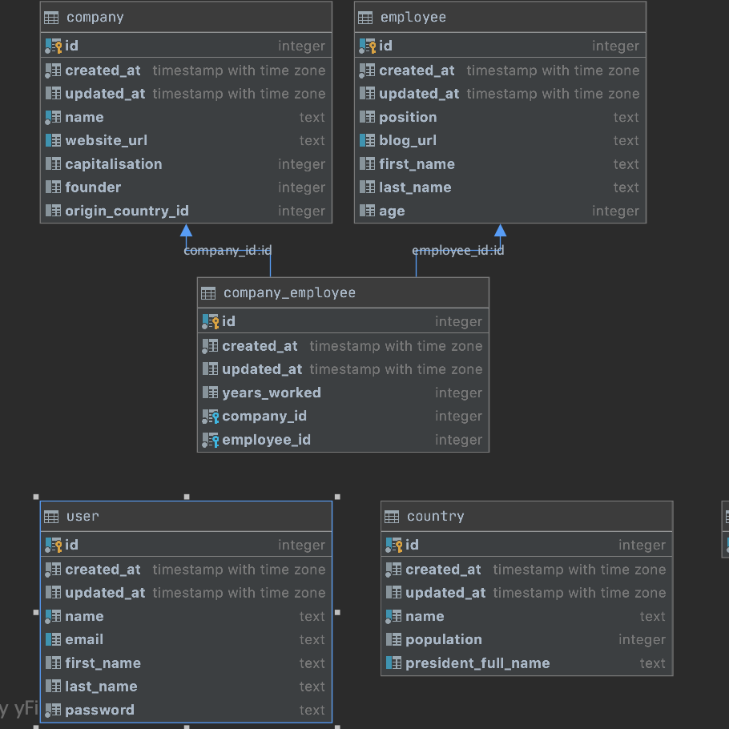

# Lab 2

## Variant 17

### Report1: [Римаренко Ілля Звіт Лаб1](https://docs.google.com/document/d/1EVRUkHbinG_9iNSauilJFgSH5-B-34Y7x3plCCV9tBg/edit?usp=sharing)
### Report2: [Римаренко Ілля Звіт Лаб2](https://docs.google.com/document/d/17ZdfCYYT3ZDMxUWPS8VKz9A44eZMwNvI09TPA0VJtpU/edit?usp=sharing)
### Screenshots:



### CLI commands(lab2 specific):
Get companies - `python3 db_labs/cli/__init__.py --option get_companies`.
Returns first 20 results.

Search for companies - `python3 db_labs/cli/__init__.py --option search_companies`
Returns first 20 results that match the query.

Create company - `python3 db_labs/cli/__init__.py --option create_company`
Creates new company.

Update company by id - ` python3 db_labs/cli/__init__.py --option update_company `
Updates company by given id.

### Prerequisites:

```
curl -sSL https://raw.githubusercontent.com/python-poetry/poetry/master/get-poetry.py | python  # poetry
```

## Useful Commands:

### Python Virtual Environment:

```
poetry shell  # activate python virtual environment
poetry install  # install dependencies
```

### Run Dev Server:

```
flask  # CLI commands
make idb # Setup and seed database
make run  # run flask dev server
```


### Database:
Using Postgresql.
```
createdb db_labs  # create DB
flask db upgrade  # run migrations
flask seed  # populate with sample data
flask db migrate  # generate new migration
flask db  # more migration commands
```

### API Documentation:

Once your flask dev server is running:

- [OpenAPI JSON](http://localhost:5000/api/openapi.json) (http://localhost:5000/api/openapi.json)
- [Swagger UI](http://localhost:5000/api/swagger) (http://localhost:5000/api/swagger)
